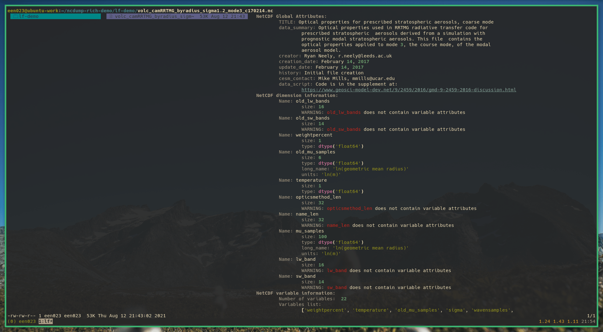
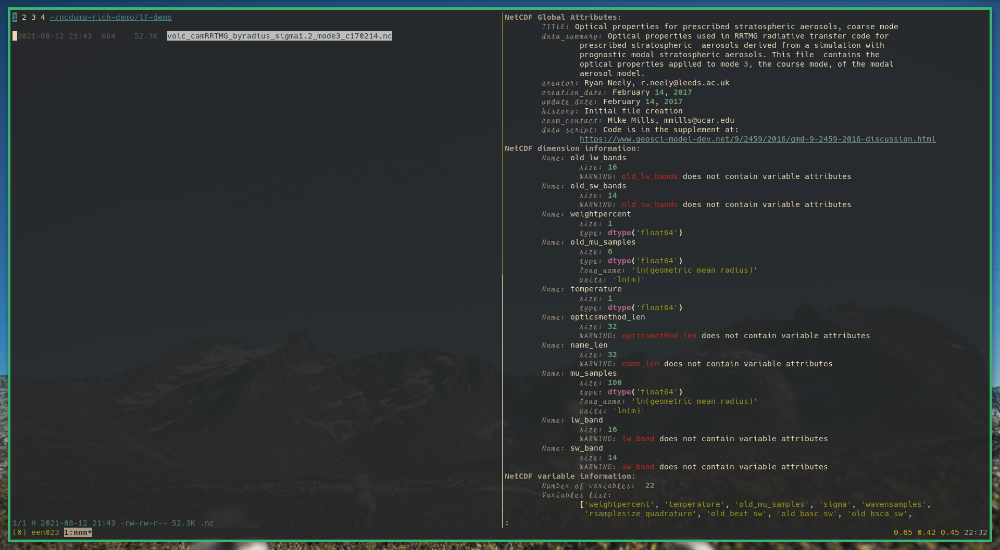

Rich NcDump
===========

|PyPI| |Status| |Python Version| |License|

|Read the Docs| |Tests| |Codecov|

|pre-commit| |Black|

.. |PyPI| image:: https://img.shields.io/pypi/v/ncdump-rich.svg
   :target: https://pypi.org/project/ncdump-rich/
   :alt: PyPI
.. |Status| image:: https://img.shields.io/pypi/status/ncdump-rich.svg
   :target: https://pypi.org/project/ncdump-rich/
   :alt: Status
.. |Python Version| image:: https://img.shields.io/pypi/pyversions/ncdump-rich
   :target: https://pypi.org/project/ncdump-rich
   :alt: Python Version
.. |License| image:: https://img.shields.io/pypi/l/ncdump-rich
   :target: https://opensource.org/licenses/GPL-3.0
   :alt: License
.. |Read the Docs| image:: https://img.shields.io/readthedocs/ncdump-rich/latest.svg?label=Read%20the%20Docs
   :target: https://ncdump-rich.readthedocs.io/
   :alt: Read the documentation at https://ncdump-rich.readthedocs.io/
.. |Tests| image:: https://github.com/engeir/ncdump-rich/workflows/Tests/badge.svg
   :target: https://github.com/engeir/ncdump-rich/actions?workflow=Tests
   :alt: Tests
.. |Codecov| image:: https://codecov.io/gh/engeir/ncdump-rich/branch/main/graph/badge.svg
   :target: https://codecov.io/gh/engeir/ncdump-rich
   :alt: Codecov
.. |pre-commit| image:: https://img.shields.io/badge/pre--commit-enabled-brightgreen?logo=pre-commit&logoColor=white
   :target: https://github.com/pre-commit/pre-commit
   :alt: pre-commit
.. |Black| image:: https://img.shields.io/badge/code%20style-black-000000.svg
   :target: https://github.com/psf/black
   :alt: Black

Features
--------

* TODO

Requirements
------------

* TODO

Installation
------------

You can install *Rich NcDump* via pip_ from PyPI_:

.. code:: console

   $ pip install ncdump-rich

or perhaps even better via pipx_:

.. code:: console
   $ pipx install ncdump-rich

Usage
-----

Please see the `Command-line Reference <Usage_>`_ for details.

Examples
^^^^^^^^

Use the program as a previewer for ``.nc`` files, for example through stpv_. `My own
fork`_ provides additional support for previewing ``.nc`` files using this project.

Preview in lf_

Similarly you can get preview of ``.nc`` files in nnn_ by including an option for the
extension ``nc`` in the `\`\`preview-tui\`\` plugin`_.

.. code:: console
   nc) fifo_pager ncdump-rich -i "$1" ;;

Preview in nnn_

Contributing
------------

Contributions are very welcome.
To learn more, see the `Contributor Guide`_.

License
-------

Distributed under the terms of the `GPL 3.0 license`_,
*Rich NcDump* is free and open source software.

Issues
------

If you encounter any problems,
please `file an issue`_ along with a detailed description.

Credits
-------

This project was generated from `@cjolowicz`_'s `Hypermodern Python Cookiecutter`_ template.

.. _@cjolowicz: https://github.com/cjolowicz
.. _Cookiecutter: https://github.com/audreyr/cookiecutter
.. _GPL 3.0 license: https://opensource.org/licenses/GPL-3.0
.. _PyPI: https://pypi.org/
.. _Hypermodern Python Cookiecutter: https://github.com/cjolowicz/cookiecutter-hypermodern-python
.. _file an issue: https://github.com/engeir/ncdump-rich/issues
.. _pip: https://pip.pypa.io/
.. _pipx: https://github.com/pypa/pipx
.. _stpv: https://github.com/Naheel-Azawy/stpv
.. _My own fork: https://github.com/engeir/stpv
.. _nnn: https://github.com/jarun/nnn
.. _lf: https://github.com/gokcehan/lf
.. _``preview-tui`` plugin: https://github.com/jarun/nnn/blob/fc00faf7d0f4cd0b4637e719af52100861e8c17a/plugins/preview-tui#L247
.. github-only
.. _Contributor Guide: CONTRIBUTING.rst
.. _Usage: https://ncdump-rich.readthedocs.io/en/latest/usage.html
